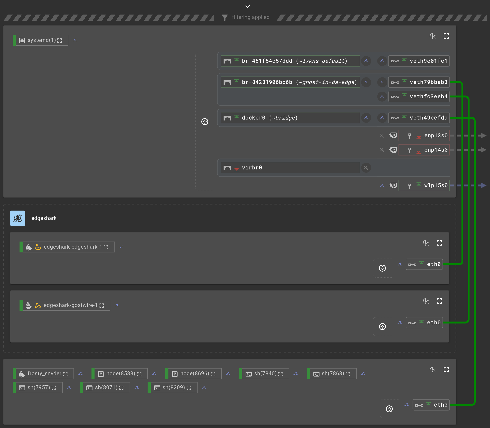
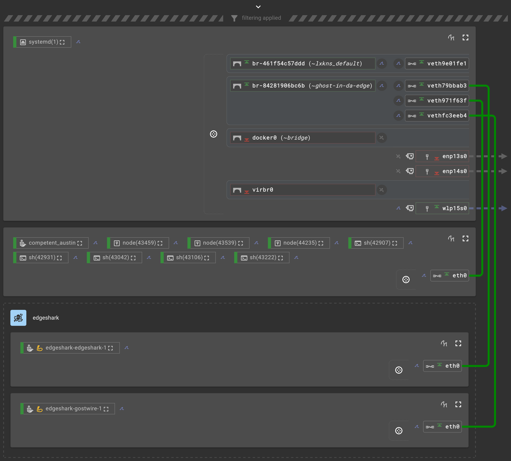

# The Docker-out-of-Docker DevContainer Feature

The maintainers of the Development Container specification kindly offer two
features to get access to Docker functionality _inside_ dev containers:

- [Docker-in-Docker](https://github.com/devcontainers/features/tree/main/src/docker-in-docker)
  feature ~ "**DinD**"
- [Docker-outside-of-Docker](https://github.com/devcontainers/features/tree/main/src/docker-outside-of-docker)
  feature ~ "**DooD**"

Just as a quick recap, "**Docker-in-Docker**" – which often is simply called
"DinD" – describes a system configuration where an "inner" Docker demon is
running _inside_ a Docker container. The inner Docker is actually _not running
inside_ the Docker demon though, as (Docker) containers are never run "inside"
their container demons/engines[^xmen].

To illustrate this situation further, here's a graphical representation of the
resulting networking, courtesy of
[Edgeshark](https://github.com/siemens/edgeshark): `frosty_maxwell` is the
devcontainer, then `virtual_insanity` is a container "inside" the devcontainer.
Please note how from the networking perspective there isn't any "inner" or
"outer", just flat, separated networking stacks. Yet Edgeshark, as the
_managing_ Docker demon actually is inside another Docker container shows a
`[frosty_maxwell]:` prefix in this situation.


In contrast, "**Docker-out-of-Docker**" describes a setup where the processes
inside a container get the host's Docker API socket (or, preferably, a Docker
proxy) mounted into their container. There doesn't seem to be a widely accepted
term for this kind of setup and unfortunately, a lot of people tend to refer to
it wholly incorrectly as "DinD". Probably, because they conflate the `docker`
CLI tool with the Docker engine/demon `dockerd`.

In the following, we call the setup where the host's Docker API socket is made
available inside a (development) container simply "**DooD**"[^dood].

## Forwarding the Docker API Endpoint

As of version 1.6.0, the DooD feature's
[`devcontainer-feature.json`](https://github.com/devcontainers/features/blob/main/src/docker-outside-of-docker/devcontainer-feature.json)
mounts the host's Docker API socket as follows:

```json
{
    // ...
    "mounts": [
        {
            "source": "/var/run/docker.sock",
            "target": "/var/run/docker-host.sock",
            "type": "bind"
        }
    ],
    // ...
}
```

While this might seem odd at first glance, there is good reason to not directly
bind-mount the API socket inside the development container as
`/var/run/docker.sock`: the DAC (discretionary access control) configuration of
the container's socket might need to differ from the host's.

But let's start simple, where the user inside the devcontainer is `root`: in
this case, the DooD feature simply _inside_ the container symlinks
`/var/run/docker.sock` to `/var/run/docker-host.sock` ... which in turn is
bind-mounted to the _outside_ `/var/run/docker.sock`.

But if the user inside the devcontainer isn't `root`, then there is one
situation out of two that needs to be dealt with:

1. if inside the development container `/var/run/docker.sock` is set to a
   non-root (non-zero) group, yet the container's `docker` group GID differs
   from the host's: then, simply change the development container's `docker` GID
   to the one used in the host, outside the container.

   That is: `/var/run/docker.sock` ╌*symlink*⤍ `/var/run/docker-host.sock`
   ╌*bind-mount*⤍ `/var/run/docker.sock`.

2. otherwise, run `socat` as `root` inside the development container to forward
   from `/var/run/docker.sock` to `/var/run/docker-host.sock` (with the latter
   being bind-mounted to the host's `/var/run/docker.sock`).

   So: `/var/run/docker.sock` ╌`socat`⤍ `/var/run/docker-host.sock`
   ╌*bind-mount*⤍ `/var/run/docker.sock`.

## Caveats Of Inter-Container Communication

Depending on how you want to use the host's Docker engine and talk to other
services, please consider the following caveats.

### Default `bridge` (`docker0`) Network

First, please keep in mind that the default networking for development
containers is to be attached to the default `bridge` network, also known as
`docker0` which is the name of the Linux-kernel virtual bridge, unless you
explicitly specify otherwise. So let's start with this default situation.

Here, your devcontainer is connected to `docker0` and wants to talk to the
service(s) of another host container that published service port(s) on the host.

Below is a graphical representation of this networking setup, courtesy of [my
own dogfood](https://github.com/siemens/edgeshark). Here, `frosty_snyder` is our
devcontainer that wants to access the G(h)ostwire service
`edgeshark-edgeshark-1` that publishes its service port on the host.



Notice, how our devcontainer `frosty_snyder` is connected to `docker0`, yet the
`edgeshark-edgeshark-1` service is connected to `ghost-in-da-edge` instead.

> [!ATTENTION]
>
> The default Docker network does **not support resolving the DNS names** of
> other services and containers.

Now, there are three ways to publish services on the host:

1. publish port on the loopback address `127.0.0.1`,
2. publish port on the unspecified address `0.0.0.0`,
3. publish port on a specific host address, such as `192.168.0.2`.

#### Published on `127.0.0.1`

In this case, you **cannot reach** this service from inside the devcontainer –
I've tested this to be sure, so [moby/moby issue
\#45610](https://github.com/moby/moby/issues/45610) does not apply here.

#### Published on `0.0.0.0`

This time, this service **can be reached**  either via the default route using
the IP address of the `docker0` bridge, or – if you know the IP host address the
service is bound to – that specific host IP address (see below).

The bridge IP address is normally also the container's default route next-hop
address. One way (again, tested) to find this bridge IP address using CLI tools
is[^overachiever]:

```bash
ip route | awk '/^default/ && !a++ { print $3 }'
```

Another way is to deploy your development container using `runArgs` to
enable the magic `host-gateway` host name and map it to, say, the famous
`host.docker.local` (also tested):

```json
{
    // ...
    "runArgs": [ "--add-host=host.docker.local:host-gateway" ],
    // ...
}
```

#### Published on Specific Host Address

Finally, if you happen to know the exact IP address the service has been
published on (and it isn't the loopback `127.0.0.1`), then you don't need the
bridge IP address, but instead you can directly use this specific IP as the
destination IP.

### Custom Docker Network

This time, your devcontainer is instead connected to a "custom" Docker network,
that is, any Docker network other than the "default" `bridge` (`docker0`)
network. The services you want to reach from your devcontainer are also attached
to the same custom Docker network, as shown next:



To attach your devcontainer to the same Docker network where the services are,
simply specify (when _not_ using composes) in your `devcontainer.json`:

```json
{
    // ...
    "runArgs": [ "--net=ghost-in-da-edge" ],
    // ...
}
```

In this configuration, simply use the service name, preferably suffixed with the
custom network name: for instance, `edgeshark.ghost-in-da-edge`.

## References

- [`docker-outside-of-docker/install.sh`](https://github.com/devcontainers/features/blob/main/src/docker-outside-of-docker/install.sh)
- [`runArgs`](https://containers.dev/implementors/json_reference/#image-specific),
  an image- or Dockerfile-specific property.

---

[^xmen]: that includes "podman", even if their marketing tries to trick people
    into thinking that podman isn't a demon, just because "it doesn't run all
    the time" – not that since the dawn of Unix we had
    [inetd](https://en.wikipedia.org/wiki/Inetd) to (re)start demons/services on
    demand that haven't yet started or spun down. Oh, "pod**man**" is terribly
    _non_-inclusive, by the way.

[^dood]: especially funny to German-speaking audiences.

[^overachiever]: this ensures to **not** match on anything else named "default"
    and also returns only the **very first match**.
