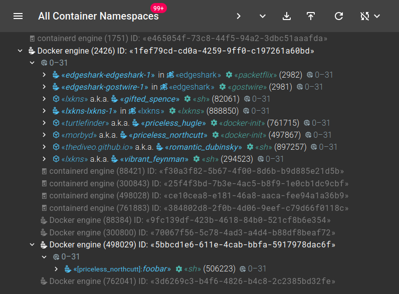

# Every Container Engine

In all these years, [lxkns](https://github.com/thediveo/lxkns) (and, in turn,
[turtlefinder](https://github.com/thediveo/turtlefinder)) have been focused on
the container workload and treated container engines only as metadata
adornments. The so-called `Containerizer` interface primarily returned the
workload in form of containers. Container engines were just seen as additional
detail information to the workload.

Over the past one or two years as devcontainers have gained more widespread
usage, with Docker-in-Docker[^Mediocre-com] now much more than a novelty. Not
least, several of Github's premade Codespace setups provide Docker in their
devcontainers: this is a separate Docker engine from the Docker engine that
manages the devcontainer itself.

On several occasions when I checked my host system using lxkns that was running
several devcontainers with Docker-in-Docker configurations I wondered if a
containerized Docker had gone AWOL. I fell victim to my own workload-centered
discovery design.

## Lazy Engines Welcome

So I decided to remedy this shortcoming: the discovery information model of
lxkns now includes all discovered container engines explicitly, even if they
don't have any workload. turtlefinder has also been updated to properly provide
engine information even for the workload-less ones.

At this point I took the opportunity to overhaul the existing "All Containers"
view in the web UI: it now shows all discovered engines, with the workload-less
engines rendered grayed out.

In addition, this view now renders engines _hierarchically_: while it is a
misconception to believe that containers live inside container engines, engines
can live inside containers. This is now reflected in the screenshot above.
However, I decided against rendering container engines directly _inside_ their
embracing containers: this would have required to always expand container nodes
and these nodes are solely intended to show the namespaces attached to a
container.

## Discovery Data

The structure of the JSON discovery data actually hasn't changed except for the
fact that it now includes the workload-less engines and a new optional `label`
object on engine objects.

The hierarchy of engines (that is, which engine is containerized where) is
passed through these new engine labels, picked up in the UI and rendered
accordingly.

## Release

These improvements have safely landed in lxkns `v0.46.0` and turtlefinder
`v2.1.0`.

#### Notes

[^Mediocre-com]: it's still a testament to the absolute absence of any quality
    of 99.999% all medium.com blog posts that they constantly mix up mounting
    the Docker socket in a container with the real Docker-in-Docker operation.
