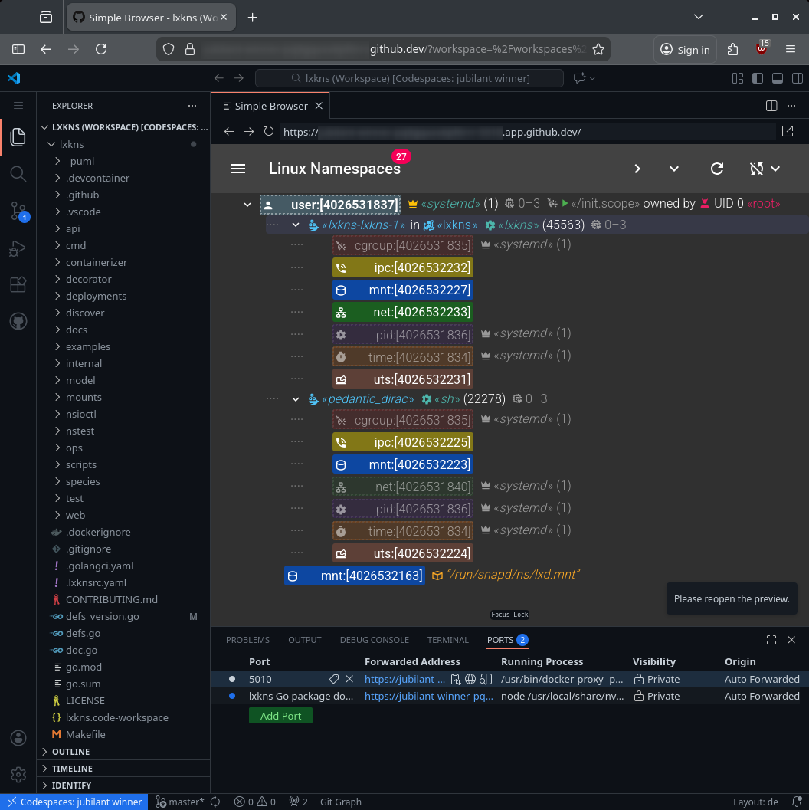
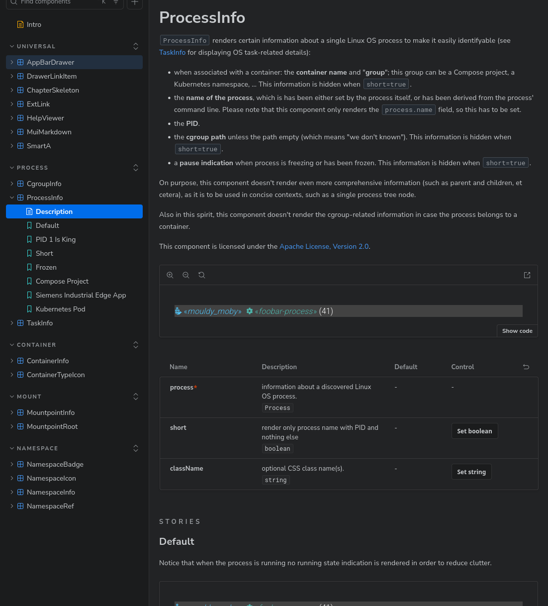

# lxkns Renovation

Finally, after quite some time, the code base of `lxkns` has seen quite a lot of
renovation.

## Devcontainerz!!!

First and foremost, `lxkns` can now be tinkered with in a [development
container](https://containers.dev/). This automatically sets up the required
developments tools, and commissions `yarn`. While this might be a snap to
seasoned ~~full stack devs~~ vibe coders, I neither claim to be a full stack dev
nor vibe coder.

The devcontainer automatically runs a local pkgsite service on port 6060, where
you can browse through the `lxkns` go doc(s).

## Codespaces

Finally having a devcontainer configuration additionally means that you can also
open it in a [Github workspace](https://github.com/codespaces/)[^cleanix], which
is so splendidly weird at this time. Make sure to select the devcontainer
configuration when creating your codespace from the `lxkns` repository, as the
default workspace setup won't help you.

After the devcontainer has been built and spun up, a further `make deploy` later
`lxkns` will be deployed into the VM hosting your devcontainer and you can
connect to its web UI at port 5010...

## Go

There has been a lot of rather boring renovation and refactoring going on, so
let's focus just on the important fixes and updates. The refactoring actually
spread over into support modules, including giving birth to the all-new
[spacetest](https://github.com/thediveo/spacetest).

* the missing detection of owning user namespaces for (directly) file
  descriptor-referenced namespaces has been fixed.

* the infinite recursion in pidtree has been fixed, when run as non-root and and
  the PID namespace of an intermediate process could not be determined, but the
  children again report the same PID namespace as above that "mysterious"
  intermediate process.

* the process table discovery now automatically picks up process/task scheduling
  policies and priorities from `/proc/PID/stat`, avoiding separate syscalls.
  Where necessary use `Process.RetrieveAffinity` and `Task.RetrieveAffinity`
  instead of the now deprecated `RetrieveAffinityScheduling` methods.

## Web UI

Obligatory xkcd reference "dependency":

After a long hibernation, the web UI was upgraded to Vite 7, React 19, MUI 7,
MUI-X 8, Storybook 10, ESLint 9 -- so it will keep us warm for another few
femtoseconds in the ever-maddening progress of web stack shenanigans.

In general, AI has been simply a complete f·**AI**·l, see also [MUI Storybook
Canvas Theming](/art/storybook-autodocs-canvas-mui-theming) and [MUI, MDX and
addon-docs](/art/storybook-mui-mdx) for just a tiny tip of the shitberg.
Contrary to the actually not independently verifiable claims of various shills
and "experts" the available AI models simply fail in migrating just a few simple
aspects of a project, and they fail spectacular beyond any reasonable doubt.
They can't differentiate between crucial major versions with major changes in
say configuration, Typescript versus Javascript, changes in how
Javascript/Typescript modules are imported, and much more. The "hallucinate"
even more than a politican.

Most natable fixes:

* fixed that expand all/collapse all actions should appear only when the current
  view (route) shows information in a tree; and not in settings, help, and
  about.

* fixed the inconsistent behavior of the expand all/collapse all actions across
  the different views, so they now always keep a sensible minimum of levels
  expanded, depending on the specific view.

* fixed the storybook support, finally ditching styleguidist due to its
  problems.

* fixed automatically setting up `yarn` in the correct (locked) version, using
  the devcontainer mechanism.

### UI Development

To work with the web UI: `cd lxkns/webui && yarn dev`. While not strictly
necessary, a `lxkns` service should be available inside the dev container on
port 5010. `make deploy` in the top-level repository directory can do the trick.

### UI Components

To work with the components stylebook: `cd lxkns/webui && yarn stylebook`. And
yes, the `lxkns` storybook has correctly working dark/light theming support.

#### Notes

[^cleanix]: please note that a lot of codespaces-mimicking offerings
    unfortunately either already fail at basic things like correct dependency
    resolution or have only half-baked support for unprivileged devcontainers.
    But hey, if it's another AI-powered AI startup it's great to sneezy into
    your naked hands and clean them on your clothes.
