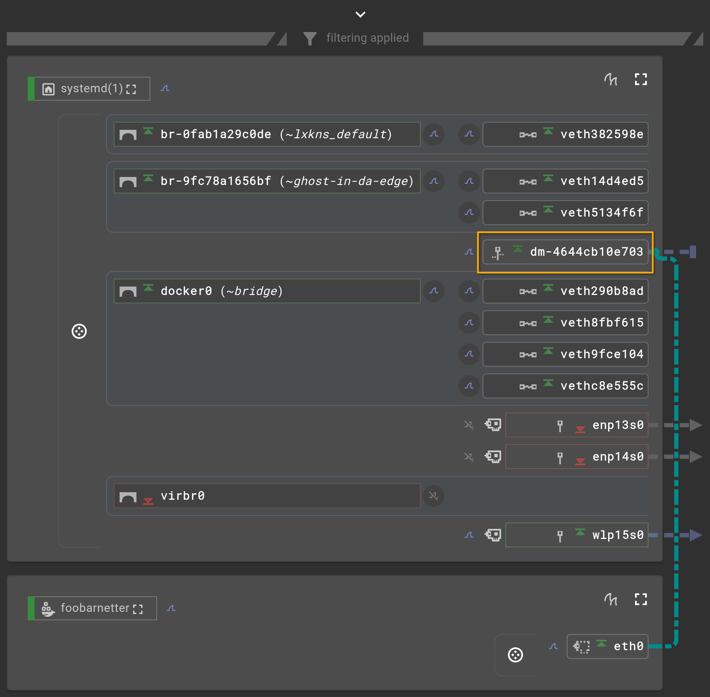

# Docker MACVLAN Networks Without a Parent

In case you are struggling with Linux MACVLAN-related terminology, you're
already forgiven.

> [!INFO] In Linux, a range of network interfaces can get additional so-called
> "**MACVLAN**" virtual network interfaces attached. These MACVLAN interfaces
> get their own MAC and IP addresses. By default, these the MACVLAN interfaces
> can talk to each other and the outside world. But they can never under any
> configuration talk to the network interface they're attached to.
> [^Further-MACVLAN-reading]

## I'm Your Master, Luke

In Linux kernel parlance the MACVLAN interfaces are termed "_slaves_". The
network interface the slaves are _linked to_ is termed the "_master_" network
interface. As unfortunate as this terminology is, this _is_ the kernel
terminology, so get over it; wiping out any form of slavery in the real world is
key, wiping out terminology in technology isn't.

The typical MACVLAN use cases are running services that need data-link layer
network access _on_ a host – but without any access to the host itself via
networking. Think DHCP and MAC address-bound software license services as
typical and long-standing IT examples. Other, more modern use cases are OT
industrial automation Ethernet-based fieldbus protocols, such as
[Profinet](https://en.wikipedia.org/wiki/Profinet).

Consequently, Docker supports such IT use cases for a long time, which
thankfully also makes OT happy.

In Docker political correct parlance, the MACVLAN master is termed "_parent_" –
which should sound even more and much louder alarm bells as it reveals an
uncanny psychological view in which the perceived politically-correct way out of
_master and slave_ is _parent and child_. Yep, conservative traditional values,
(far) right. 😬

## Dummy-Powered

Traditionally, the Docker "macvlan" driver was understood to need passing a
particular driver option when attempting to create a MACVLAN Docker network: `-o
parent=$IFNAME`. Apparently, `libnetwork` introduced its "macvlan" driver in
v1.11.0 (based on some github docker repo vendor directories archaeology) and
right from the start supported parent-less creation.

In case no explicit parent interface was specified, Docker's "macvlan" driver
creates its own virtual parent/master network interface of type "dummy". Dummy
network interfaces serve as black holes that simply swallow all traffic that
processes try to send through them. The MACVLAN slaves linked to them can still
talk to each other without any problems. If we try to talk to the outside, the
dummy will just blackhole their packets.

As usual, [Edgeshark](https://github.com/siemens/edgeshark) is a great tool for
visualizing the resulting virtual networking topology: the `dm-...` named
network interface is the dummy interface acting as the MACVLAN master
(highlighted in the screenshot). Edgeshark additionally shows a cul-de-sac to
indicate that all its outgoing traffic gets sacked.



## Always Internal

The "macvlan" driver also supports creating a MACVLAN network as "internal".
Albeit, based on the `docker-v29.6.2` source code of
[`macvlan_network.go`](https://github.com/moby/moby/blob/3d80467678f6e36325fa9ae3dd486fe91e5652e3/daemon/libnetwork/drivers/macvlan/macvlan_network.go#L234)...

```go
// With no parent interface, the network is "internal".
if config.Parent == "" {
    config.Internal = true
}
```

...parent-less dummy-powered MACVLAN networks are _always_ internal anyway.

## Unspecified Subnet

Docker v29 recently introduced a useful enhancement: when creating a custom
Docker network, specifying a subnet with an unspecified IP address but the
subnet size (`0.0.0.0/28`) automatically grabs a subnet of the specified size
from the Docker demon's default address pool. No more `/16` wasting. Docker
perfectly allocates multiple smaller unspecified subnets from a larger single
pool, moving to the next suitable one as needed.

This is especially convenient in the context of parent-less (dummy-powered)
case: less address wasting without the hassle of hardcoded specific subnet
address ranges.

#### Notes

[^Further-MACVLAN-reading]: Sreenivas Makam's Blog: [Macvlan and IPvlan
    basics](https://sreeni.blog/2016/05/29/macvlan-and-ipvlan/)
