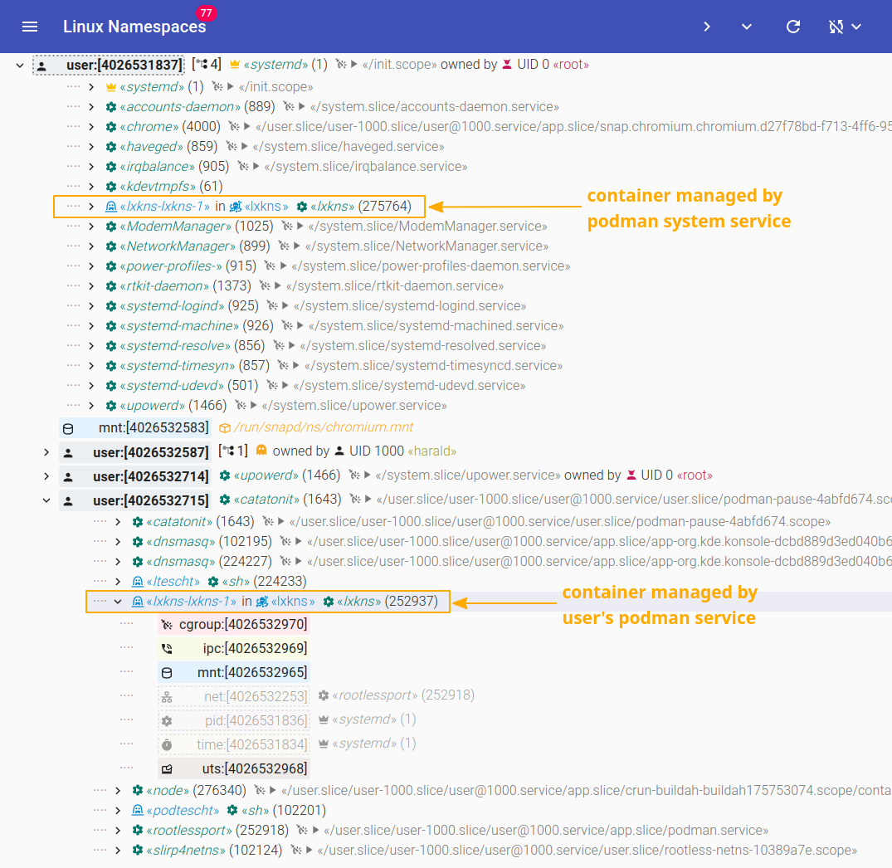

# `alias podman=p.o.'d.man`


All I wanted to do was to add [Podman](https://podman.io) awareness to my
[lxkns](https://github.com/thediveo/lxkns) discovery engine for Linux kernel
namespaces and containers. I went down a Monty Python rabbit hole.

## The Meaning of Life: Don't Be Docker

So, [what is podman?](https://podman.io/whatis.html):

> Simply put: `alias docker=podman`

\**cough*\* when you define your own identity primarily as "**not** being X"
that doesn't exactly bode well. But then, didn't Brian say: "_You have to be
different_"...?

## Life of Brian: He Said "Daemon"!

Slightly hilarious, the Podman documentation tends to stress a lot how Podman is
"daemonless".

As it happens, Podman for some time now can be deployed as a system _service_
(especially via `systemd`). But never say "daemon".

That makes me wonder: there are so many incredibly neat container development
tools out there that work with Docker – let's name here just the [VSCode Docker
extension](https://code.visualstudio.com/docs/containers/overview) pars pro
toto. Did the pod men seriously expect all these tool developers to all
integrate the Podman-specific CLI tools or API client? Especially when the
podman client requires a heavy dose of C headers and libraries to be installed
first?

A faint trace of "hubris", _perfume_?

## Semvers: We're All Individuals!

As long as one sticks with Podman's **Docker-compatible API**, all is well:
Docker has a long-standing record in keeping its 1.x REST API very stable, yet
constantly evolving. You build tools from latest stable client sources? The
Docker client will negotiate appropriately, but unless you insist on using the
latest-and-greatest REST API feature, the Docker clients and servers won't ever
block you out.

The Podman-specific REST API is a different story though. Install podman
packages from the long-term stable Debian 11 or Ubuntu 22.04LTS repos and there
are only v3.4.x packages available. Next, build a podman REST API client from
current stable and then try to connect: boom! The v4 client **rejects
connecting** to a v3 podman service.

To add insult to injury: the pod men don't maintain the v3 code base anymore
(except for maybe a few rare circumstances, but no guarantees whatsoever given).
However, there is **no podman v4 in the long-term stable distributions of Debian
and Ubuntu LTS**. While there currently is  [experimental(!) podman 4.2.0 Debian
package](https://packages.debian.org/experimental/podman) people need to know
about and install it manually.

## Contexts Go Home!

Brushing Semver woes aside, let's create a Podman REST API client using
`NewConnection`, which works the same for v3 and v4:


... ? ... ??? ... wait, `NewConnection` is returning a
[`context.Context`](https://pkg.go.dev/context#Context)? A Podman REST API
**client** – or connection for what it is worth – is modelled as a Go `Context`?
You must be kidding ... _please_?

It isn't that the [Go documentation](https://pkg.go.dev/context) about
`Context`s appears to be inscrutable:

> Package context defines the Context type, which carries deadlines,
> cancellation signals, and other request-scoped values across API boundaries
> and between processes.

Somehow it looks as if none from the Podman project took heed of "_carries [...]
**request-scoped** values_" (emphasis mine) or why would someone model a
potentially very long-living _client connection_ as a request-scoped _context_?

Unfortunately, the situation actually is much worse and not just bickering about
some seemingly superficial semantics. When looking at
[`binding.go`](https://github.com/containers/podman/blob/6f498cba3ec6265ea0201e6614e7e5f7b26496aa/pkg/bindings/connection.go#L126)
we'll find the following code (irrelevant details left out for clarity and
brevity):

```go
case "unix":
    connection = unixClient(_url)
// ...
ctx = context.WithValue(ctx, clientKey, &connection)
// ...
ctx = context.WithValue(ctx, versionKey, serviceVersion)
return ctx, nil
```

The actual connection (client) object gets attached to the initially passed
context and only the context returned as a substitute for the "connection".

**\*facepalm\***

One thing here is the total ignorance and violation of `Context` design to be
request-scoped. But this now forces any (appication/service handler) code that
needs to issue Podman API calls to pass a global "connection" context around
everywhere.

This is especially bad when Podman API calls are needed as part of a request to
a service and that request comes – as usual – with its request-scoped context.
Now you can't use the request-scoped context because you are forced to use
instead the context-turned-connection for any Podman API calls. And you thus
need to manually carry over any deadlines and cancellations from the (upstream)
service-scoped context into Podman API calls.

So I wrote [@thediveo/wye](https://github.com/thediveo/wye) (pronounced "waɪ")
to somehow tape over this FUBAR'ed Podman API client design: it is mixing the
deadline and cancellation signals from a request-scoped context into a Podman
connection context – kind of a "Y" operator for `Context`s. Please refer to the
[wye package documentation](https://pkg.go.dev/github.com/thediveo/wye) for
usage details; but the gist is as follows:

```go
   ctx, cancel := wye(podmanctx, servicectx)
   defer cancel()
   details, err := pods.Inspect(ctx, "doh", &pods.InspectOptions{})
```

As if this weren't already bad, Podman API calls go through stage:

```go
func (c *Connection) DoRequest(httpBody io.Reader, ...) ...
```

Do you notice something, or rather its absence?

There's **no context getting passed** when doing requests; the `*Connection` is
the real connection, not the "connection" context. To prove my worst fears, this
is what then follows:

```go
req, err := http.NewRequestWithContext(context.WithValue(context.Background(), clientKey, c), httpMethod, uri, httpBody)
```

The v3 REST API client issues all requests using the background context. A
caller can cancel the originally passed context however them wants without any
reaction. **\*facepalm\***

There's not even a "TODO" comment to somehow excuse this bonkers behavior.

I suspect that actually almost no one is really using the Podman-specific API
and "everyone" is simply going with the Docker API and the Docker REST API
client. No semver woes, rock solid, easy to build without lots of header files
and development C libraries.

## Will You Please Listen?

By comparism, `system.Events` is the lesser nuisance. Admittedly, it took me
Podman's botched `system.Events` design to actually understand how sleek and
smooth Docker's `client.Client.Events` is: pass the events we're interested in
and we get back two channels, one for the events and another one for errors.

```go
eventsch, errch := client.Events(ctx, types.EventsOptions{Filters: evfilters})
```

We don't need to care about how the Docker client manages to get the events and
how it passes them on to us, we just read from the returned channels. Regardless
of whether `Events` immediately fails at first attempt, or any time later: we
always will receive any error via the returned error channel.

Brian: "_You have to be different_."

To start with, we have to create the channels ourselves; which isn't much of a
big deal.

```go
evs := make(chan entities.Event)
cancelch := make(chan bool) // close to terminate event watching
```

However, `system.Events` is designed to be **synchronous**. That means that we
need to call it in a separate goroutine in order to not block our normal
processing. But to throw a spanner in our works, `system.Events` may return an
error _synchronously_ – while we're in a concurrent go routine. Argh!

This requires a totally convoluted handling:

```go
cntreventstream := make(chan engineclient.ContainerEvent)
cntrerrstream := make(chan error, 1)

evs := make(chan entities.Event)
cancelch := make(chan bool) // close to terminate event watching

apierr := make(chan struct{})
go func() {
   defer close(cntrerrstream)
   defer close(apierr)

   err := system.Events(ctx, evs, cancelch, &opts)
   if ctxerr := ctx.Err(); ctxerr != nil {
      if conn, _ := bindings.GetClient(pw.podman); conn != nil {
         conn.Client.CloseIdleConnections()
      }
      err = ctxerr
   }
   if err != nil {
      cntrerrstream <- err
   }
}()
defer close(cancelch)
for {
   select {
   case <-apierr:
      return // API error has already been sent down the error channel.
   case <-svcctx.Done():
      // Cover up for the bad job of the v3 client: it completely
      // ignores any cancellation/deadlines of the supplied context.
      return // will tell system.Events to cancel.
   case ev := <-evs:
      // ...event handling
   }
}
```

## Muslmakers

Building a podman v3 REST API client on Alpine with
[musl](https://www.musl-libc.org/) was a challenge. While I understand the pod
men's sentiment regarding musl when it comes to the container engine-related
aspects, a REST API client isn't affected by such details. However, with the
jumbled podman code base it is affecting it where it shouldn't. At v3, the pod
men really should have been able to properly segregate the REST API client.

Before my [PR](https://github.com/containers/podman/pull/15805), the v3
(v3.4.8-dev) client could only be compiled on Alpine after patching
`podman/pkg/rootless/rootless_linux.c`:
  1. set up a Go modules workspace,
  2. check out the podman v3.x source code repository,
  3. patch `podman/pkg/rootless/rootless_linux.c`,
  4. copy in the actual application sources,
  5. `go work use` the podman module source directory, as well, as the
     actual application module directory,
  6. install several distribution packages which actually aren't needed for a
     Podman REST API client, but are needed nevertheless to successfully build
     the whole podman module.

As of commit
[`4ad9628`](https://github.com/containers/podman/commit/4ad96289891aef43904acc56f9fd90f112d78a1c)
or later the v3 REST API client can finally be build on Alpine without the need
to patch.

## At Long Last...

With [@thediveo/sealwatcher](https://github.com/thediveo/sealwatcher)
implementing the required Podman container workload watching,
[lxkns](https://github.com/thediveo/lxkns) finally has become Podman-aware.

Deploying **lxkns** as a system service does not only support the container
workload of the Podman system service, but even the users-specific "rootless"
container workloads.



To be honest, if I had to start over again, next time I would simply completely
ignore the Podman API and just use the Docker-compatible API with the stable and
easy-to-use Docker Go client.

## Final Quote

_All right, but apart from a stable API, an uncomplicated client, good
usability, and easy operation, what has Docker ever done for us?_
