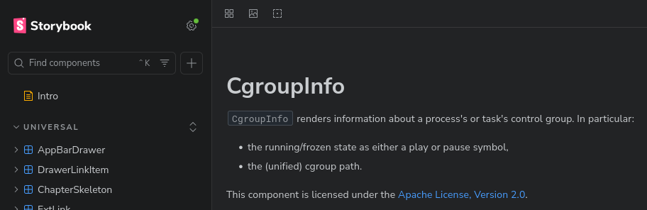
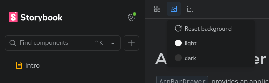
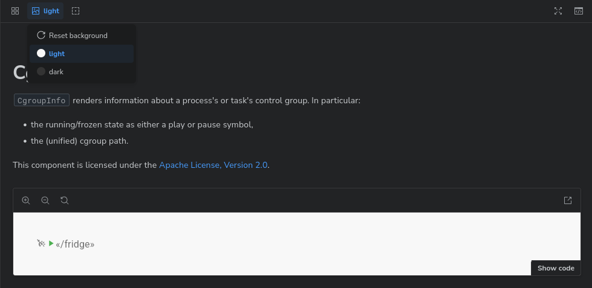

# Correct Canvas Theming for Storybook 10 with MUI 7

What if ... you simply want to have Storybook's automated documentation using
the same theme as the sidebar? And then correctly working interactive theme
switching for the rendered components, preferably defaulting to the sidebar's
theme at start? With only a single theme selector button?

## Complete f·AI·l

Friends don't let friends waste precious lifetime on degenerative AI vomitting
[Psychomagnotheric
Slime](https://en.wikipedia.org/wiki/Ray_Stantz#Ghostbusters_II_(1989)) code, it
is enough that I tried and ended up with 5× the necessary code ... and that slop
was only _sometimes working somewhat_.

To add insult to the injury, Storybook's own [Integrate Material UI with
Storybook recipe](https://storybook.js.org/recipes/@mui/material/) is seemingly
partly slop leading users into wrong directions. It creates confusion by adding
a second(!) theme selector to the autodoc/story view, so hardly the epitome of
good UX.

## Starting Point

My current web UI app project setup for the renovation of
[lxkns](http://github.com/thediveo/lxkns) is as follows at the time of writing:

- [React](https://react.dev/) 19 (19.2),
- [Vite](https://vite.dev/) 7 (7.3),
- [MUI](https://mui.com/) 7 (7.3),
- [Storybook](https://storybook.js.org/) 10 (10.1)
  - @storybook/addon-docs 10 (10.1).

## `main.ts`

My `main.ts` is pretty run-of-the-mill and shown here just for completeness: it
pulls in the `@storybook/addon-docs` add-on. However, it **doesn't use**
~~`@storybook/addon-themes`~~.

```ts
import type { StorybookConfig as StorybookViteConfig } from '@storybook/react-vite'
import { mdxConfiguration } from '../src/mdxconfig.ts'

const config: StorybookViteConfig = {
    framework: {
        name: '@storybook/react-vite',
        options: {},
    },

    stories: [
        '../src/**/*.stories.@(ts|tsx)',
        '../src/*.mdx',
    ],

    addons: [
        '@storybook/addon-docs',
    ],

    docs: {
        defaultName: 'Description',
    },

    core: {
        disableTelemetry: true,
        disableWhatsNewNotifications: true,
    },

    typescript: {
        check: true,
    },

}

export default config
```

## Autodocs Theme Sync

We start by fixing the annoying behavior of addon-docs that the automatic
documentation always uses a light theme. Instead, we make it to take on the same
light or dark theme as the storybook's sidebar using the magic `themes.normal`:
this is automatically initialized to either `"light"` or `"dark"` depending on
the browser's or system's configured color scheme preference.

Put the following into your `preview.tsx`:

```tsx
// preview.tsx
import type { Parameters, Preview } from '@storybook/react-vite'
import { themes } from 'storybook/theming'

export const parameters: Parameters = {
    docs: {
        theme: themes.normal, // use same theme as the surrounding parts
    },
}
```

Ah, that's much better and one eyesore less:



## Light/Dark MUI Themes

Next, we need a light and a dark MUI theme; the simplest way is to simply do...

```tsx
// preview.tsx
import { createTheme } from '@mui/material/styles'

const lightTheme = createTheme({ palette: { mode: 'light' } })
const darkTheme = createTheme({ palette: { mode: 'dark' } })
```

...and let MUI do the heavy lifting. Here, we pass
[`createTheme`](https://mui.com/material-ui/customization/theming/#createtheme-options-args-theme)
just a minimalist theme object that then gets filled with the missing elements.

In your own MUI application you might have already done some theme customization
and added [custom
variables](https://mui.com/material-ui/customization/theming/#custom-variables),
such as covering colors for specific components outside the scope of MUI itself.

## Preview Wrap

First, we're going to avoid `withThemeFromJSXProvider` and
`@storybook/addon-themes` completely; what's the point of having a second and
confusing theme selector?

And here comes the real "know-how" part where I could not find any documentation
and where storybook's own AI bot -- as bad as other AI systems -- were producing
only absolute crap.

Instead, simply looking[^console.log] at what gets passed as a so-called
`context` to preview decorator functions reveals a global
[`backgrounds`](https://storybook.js.org/docs/essentials/backgrounds#configuration)
"feature" -- while `backgrounds` is documented with certain fields, there's a
`value` field that isn't documented. When playing around with the theme selector
(see screenshot) the `value` field thankfully follows suit...



...where the values of `value` (yes, naming is hard) are:

- `undefined`, that is, not present,
- `light`,
- `dark`.

All we need to do, is to use `context.globals.backgrounds?.value` if set, or
otherwise fall back to the detected color scheme preference from
`themes.normal.base` (which is either `light` or `dark`).

Then it's the usual wrapping hierarchy of MUI's `StyledEngineProvider` and
`ThemeProvider` (with the correct concrete theme palette settings, et cetera).
Let's finally throw in a `MemoryRouter` so we can also work with components that
do navigation or need to know the current route. For our `MemoryRouter` we use
`context.parameters` with a self-invented `routerProps` element on top: if
present, it is passed to the `MemoryRouter`; otherwise, we apply sensible
defaults to our memory router component.

```tsx
// preview.tsx
import type { Preview } from '@storybook/react-vite'
import { StyledEngineProvider, ThemeProvider } from '@mui/material/styles'
import CssBaseline from '@mui/material/CssBaseline'
import { MemoryRouter } from "react-router-dom"

const preview: Preview = {
    decorators: [
        (Story, context) => {
            const isDark = (context.globals.backgrounds?.value || themes.normal.base) === 'dark'
            const theme = isDark ? darkTheme : lightTheme

            const routerProps = context.parameters.routerProps || 
                { initialEntries: ["/"] }

            return (
                <StyledEngineProvider injectFirst>
                    <ThemeProvider theme={theme} >
                        <CssBaseline enableColorScheme />
                        <MemoryRouter {...routerProps}>
                            <div style={{background: theme.palette.background.paper}}>
                                <Story />
                            </div>
                        </MemoryRouter>
                    </ThemeProvider>
                </StyledEngineProvider>
            )
        },
    ],
}

export default preview
```

We can now select which theme to use for rendering our components in our
stories, using the "change background"[^theme-button] menu button at the top left of an
automatically generated story:



By wrapping the `Story` into a `div` with its background set to the selected MUI
 `theme.palette.background.paper` (or alternatively
 `theme.palette.background.default`) we ensure that a MUI background is set,
 regardless of the background setting inherited from any storybook theme.

Job done. Clear, precise. No slop.

## `preview.tsx`

That's it, all in a single place and with the usual MUI boilerplate (and maybe a
tiny bit more). `lxknsLightTheme` and `lxknsDarkTheme` are two MUI themes with
custom variables (which don't matter to us here).

```tsx
import type { Parameters, Preview } from '@storybook/react-vite'
import { themes } from 'storybook/theming'

import '@fontsource/roboto/300.css'
import '@fontsource/roboto/400.css'
import '@fontsource/roboto/500.css'
import '@fontsource/roboto/700.css'
import '@fontsource/roboto-mono/400.css'

import { MemoryRouter } from "react-router-dom"
import { lxknsDarkTheme, lxknsLightTheme } from 'styles/themes'
import { StyledEngineProvider, ThemeProvider, createTheme } from '@mui/material/styles'
import CssBaseline from '@mui/material/CssBaseline'

const lightTheme = createTheme(
    { palette: { mode: 'light' } }, lxknsLightTheme)
const darkTheme = createTheme(
    { palette: { mode: 'dark' } }, lxknsDarkTheme)

export const parameters: Parameters = {
    docs: {
        theme: themes.normal, // use same theme as the surrounding parts
    },
}

const preview: Preview = {
    decorators: [
        (Story, context) => {
            const isDark = (context.globals.backgrounds?.value || themes.normal.base) === 'dark'
            const theme = isDark ? darkTheme : lightTheme

            const routerProps = context.parameters.routerProps || 
                { initialEntries: ["/"] }

            return (
                <StyledEngineProvider injectFirst>
                    <ThemeProvider theme={theme} >
                        <CssBaseline enableColorScheme />
                        <MemoryRouter {...routerProps}>
                            <div style={{background: theme.palette.background.paper}}>
                                <Story />
                            </div>
                        </MemoryRouter>
                    </ThemeProvider>
                </StyledEngineProvider>
            )
        },
    ],
}

export default preview
```

#### Notes

[^console.log]: oh, these wonders of primeval logging!

[^theme-button]: using an image icon for the theme change button is yet another
    level of UX from the makers of storybook.
