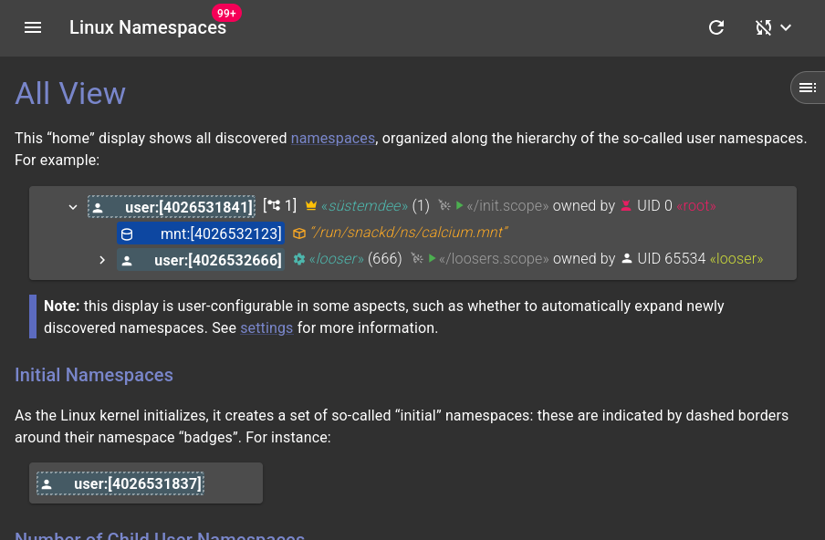

# MUI with MDX in Storybook addon-docs

...or: Another trip down the degenerative slop(e).

## MUI with MDX

The web UI of my [lxkns](https://github.com/thediveo/lxkns) Linux namespace
discovery service uses MDX to provide its own airgapped rich help. In
particular, MDX allows to reuse the UI components to render illustrative
examples directly inside the help.



As lxkns uses [Vite 7](https://vite.dev/) the configuration of `vite.config.ts`
is straightforward using `@mdx-js/rollup` (MDX 2/3). The `mdxConfiguration`
simply sets a bunch of remark, textr, and rehype plugins to be used when
processing MDX.

```ts
// vite.config.ts
import { defineConfig } from 'vite'
import react from '@vitejs/plugin-react'
import tsconfigPaths from 'vite-tsconfig-paths'
import svgr from 'vite-plugin-svgr'
import mdx from '@mdx-js/rollup'

import { mdxConfiguration } from './src/mdxconfig.js'

export default defineConfig({
    plugins: [
        {
            enforce: 'pre',
            ...mdx(mdxConfiguration)
        },
        tsconfigPaths(),
        react(),
        svgr({
            svgrOptions: {
                icon: true,
            }
        }),
    ]
})
```

So far, so good.

## Storybook with MUI+MDX

Unfortunately, out of the box Storybook stories rendering crashes – the reason
being that the MDX plugin gets pulled in twice, once by the Vite/rollup
configuration, and another time by Storybook's own configuration when using
`@storybook/addon-docs`.

To be clear, we're not talking about writing Storybook MDX but about having
stories where the documented components themselves use MDX.

As usual, Storybook's own slopbot was a time-wasting failure, producing
incorrect and mostly context-free garbage, so we skip that and cut right through
the nonsense. Thankfully, after some time a dev analyzed the situation and gave
useful advice.

The following solution keeps the existing `vite.config.ts` "as is" and
especially does not "pollute" it with Storybook-related hacks. Instead, we
configure Storybook's MDX plugin with the necessary remark, textr, and rehype
plugins and **otherwise drop any Vite-inherited MDX plugin configuration** in
our custom
[`viteFinal`](https://storybook.js.org/docs/api/main-config/main-config-vite-final).

```ts
// .storybook/main.ts
import type { StorybookConfig as StorybookViteConfig } from '@storybook/react-vite'
import { mdxConfiguration } from '../src/mdxconfig.ts'
import type { Plugin } from 'vite'

const config: StorybookViteConfig = {
    framework: {
        name: '@storybook/react-vite',
        options: {},
    },

    stories: [
        '../src/**/*.stories.@(ts|tsx)',
        '../src/*.mdx',
    ],

    addons: [
        {
            name: '@storybook/addon-docs',
            options: {
                mdxPluginOptions: {
                    mdxCompileOptions: {
                        ...mdxConfiguration,
                    }
                },
            }
        },
        '@storybook/addon-links',
    ],

    async viteFinal(config) {
        // drop the @mdx-js/rollup plugin that we get from the vite
        // configuration, as this otherwise causes problems with the mdx plugin
        // brought in by @storybook/addon-docs.
        config.plugins = config.plugins?.filter(e => (e as Plugin)?.name !== '@mdx-js/rollup')
        return config
    },

}

export default config
```

Here, `mdxconfig.ts` is the reused MDX plugin configuration. Unfortunately, from
looking at the way `@mdx-js/rollup` works it doesn't seem reliably possible to
recover the original configuration passed to it in the `vite.config.ts`
instantiation. The reused `mdxconfig.ts` at least gathers the MDX plugin
configuration in a single place for better maintenance.
