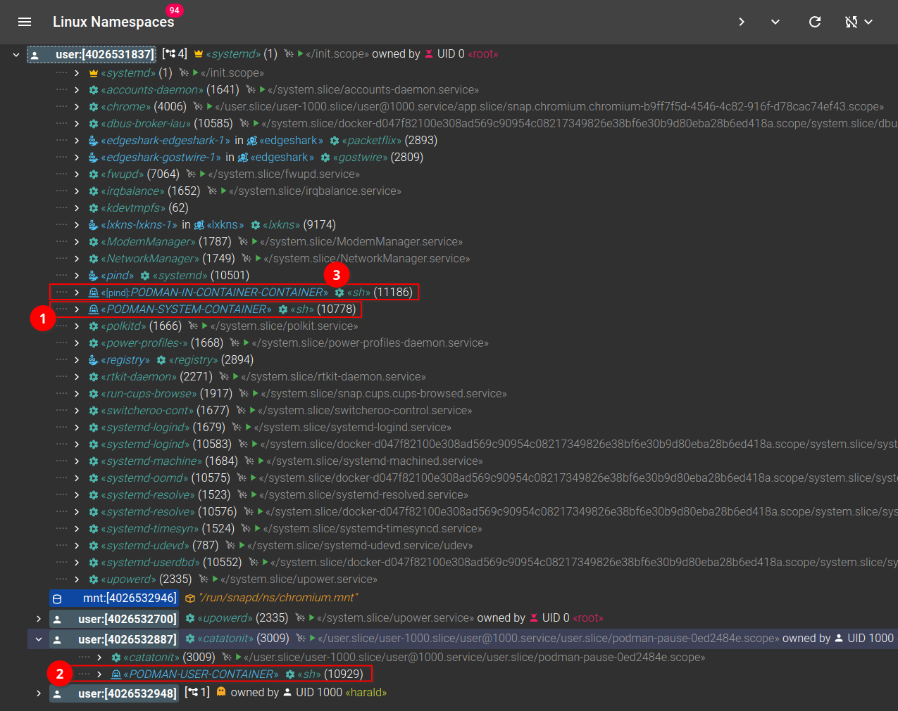

# Finding Turtles Everywhere

Back around June of 2023, Siemens open source'd its [Edgeshark
project](https://github.com/siemens/edgeshark) for discovering virtual
communication in Linux hosts and for capturing container network traffic using a
Wireshark plugin. Part of this project is what is named **["the turtle
finder"](https://github.com/siemens/turtlefinder)** for discovering container
engines, whether they are inside the host or _inside another container_. When a
container engine instance is detected, its workload then gets continously
monitored (tracked) in the background.

> [!INFO] The container engine workload monitoring initiated by `turtlefinder`
> is **always using in-process built-in native engine API Go clients[^1]**. We
> **never execute arbitrary other client binaries** that happen to lay around in
> our `PATH` – like cocked traps.

The initial implementation discovered container engines by scanning the process
tree of a Linux system for well-known container engine process names, namely
`dockerd`, `containerd`, and `crio`[^2].

However, this would not detect [`podman`](https://podman.io): while podman can
be run as a ~~demon~~^Wservice using `podman system service`, it runs _only on
demand_ and then terminates after a few seconds when idle. It thus literally
disappears from the process tree.

## Detecting Transient Engine ~~Demons~~Services

A common enough system configuration after installing podman seems to be the
so-called ["socket
activation"](https://0pointer.de/blog/projects/socket-activated-containers.html)
via `systemd`. Here, `systemd` creates an API endpoint in form of a listening
unix domain socket and then monitors the socket for some process connecting to
it. Then, `systemd` starts the associated service (podman) and passes it a
reference to the listening socket, so that it can accept the connection and
serve the connected client process. Podman typically gets configured to serve a
system-wide API endpoint (`/run/podman/podman.sock`), as well as user-specific
API endpoints (`$XDG_RUNTIME_DIR/podman/podman.sock`, a.k.a
`/run/user/[UID]/podman/podman.sock`).

But how can we detect these container engine instances when they're not
active/running...?

1. scan the file system for API endpoint sockets – doable, but too time
   consuming for an initial discovery and we would need to deal somehow with
   figuring out all the `tmpfs` instances, and many more nitty-gritty details to
   solve.

2. scan `systemd`'s socket configuration – again, doable, but highly tied to the
   moving target of `systemd` configuration files. And we would not know which
   ones might have been disabled.

3. connect to `systemd` and ask it for its socket configuration – also doable,
   but far from desirable, not least with having to muck around with `dbus`
   communication...

4. first scan for socket-activating processes (such as `systemd`) and then scan
   the processes found for the listening unix domain sockets they have open;
   discover the socket paths for these, and use those that match well-known
   names, such as a `podman.sock` suffix.

In the end, option 4 looked highly promising and has finally landed in the
[turtlefinder](https://github.com/siemens/turtlefinder) code repository on the
`main` branch.

## It's Always the Activator

However, the process of determining which sockets of a process are actually
listening unix domain sockets, as well as determining their path names, is not
the cheapest process – so we don't want to do this on each and every discovery.
We thus first calculate a hash over _all_ open sockets of a socket activators,
such as `systemd`: this basically hashes the `socket:[#ino]` strings for, say,
`/proc/1/fd/*`.

Only if we notice a change in the process socket configuration – assuming that
`systemd` doesn't constantly create client sockets, et cetera – we ran the more
expensive parts of the discovery: that's namely determining the paths of the API
endpoint sockets, using `/proc/[PID]/net/unix`. `net/unix` unfortunately gives
us all open unix domain sockets (including those from the abstract path
namespace) with their inode numbers. We then have to find the matching inode
numbers as per the open file descriptors of a socket activator process.

Activating a matching API endpoint then is just a simple `connect` syscall, but
there's an unfortunate catch. For proper operation of the whole
lxkns/whalewatcher machinery, we need to known the PID of the engine that we are
just activating ("don't call it waking demons!"). True, there's a socket option
in Linux to get the peer credentials including the PID from a unix domain
socket. Unfortunately, that doesn't work the way we need it in case of socket
activation: the PID returned will always be the PID of the socket activator
itself, not of the activated engine process.

🤦

`turtlefinder` solves this problem (admittedly not very elegantly) by polling
the process filesystem for new processes of the socket activator process to
appear, with the correct engine process name. That is something not terribly
efficient and we usually have to poll multiple times until we see the activated
engine process.

## Over-Accepting

**Wait...?!** We have to poll _multiple_ times after we're successfully
connected to the endpoint API socket? Why are we even already connected...?

Unfortunately, that's correct; for "whatever" reason, a client connecting to a
socket-activated endpoint gets an immediate connect confirmation.

Coincidentally, back in 2013 [Chris Siebenmann](https://utcc.utoronto.ca/~cks/)
(who also blogs about Go) wrote a blog post about [The meaning of `listen(2)`'s
backlog
parameter](https://utcc.utoronto.ca/~cks/space/blog/unix/ListenBacklogMeaning) —
which I only came across later after finding out Linux' behavior the hard way.
At least, I'm obviously not making this up.

> [!EMPHOURS]
> If you read your typical Unix manpage for `listen()`, it will say something like:
> 
> "The _backlog_ argument defines the maximum length to which the queue of
> pending connections for _sockfd_ may grow."
> 
> **'Pending' may also have various different definitions. The minimal one is
> 'the other side has had `connect()` succeed', ie the kernel has successfully
> accepted and established the connection on your behalf
> ([cf](https://utcc.utoronto.ca/~cks/space/blog/programming/SocketListenLimitation));**
> [...]

🤦

This robs me of another chance to blame `systemd`.

Anyway, that at least now gives `turtlefinder` the ability to detect `podman`
services when activatable through API endpoint sockets.

> [!NOTE] The Docker demon (as well as `containerd`) actually are also usually
> socket-activated. But as these are very often used already for the discovery
> workload itself, they're up and constantly running anyway. No need to go
> through all the hassle of socket activator and endpoint socket discovery.

## Finding Podmen

Now, with the socket-activator support in place, downstream tools using
[lxkns](https://github.com/thediveo/lxkns) with
[turtlefinder](https://github.com/siemens/turtlefinder) are finally able to
detect socket-activatable "podmen". And here's some "solid screenshot evidence"
next:

This screenshot shows that three podman-managed containers have been found,
belonging to three different podmen service instances. These podman services
have been automatically detected and activated in order to properly this
container workload:

1. system-wide podman instance in the host.

2. user-specific podman instance in the host.

3. "system-wide" podman instance in a \*&#8203;_cough_&#8203;\* Docker
   container: please notice how the container name is prefixed with "`[pind]:`"
   to indicate the enclosing outer container.

The first discovery after the initial discovery service startup thus will be
slightly slower, depending on the number of socket-activatable engine instances
discovered that also need to be spun up and queried for their workload. After
that, the usual event-based background workload tracking keeps load and delays
at minimum.

## Workload Monitoring

A side effect of the permanent background workload monitoring is – of course –
that these podman engines are also constantly kept alive. This is anyway the
same situation as when using tools like the [VSCode "Docker"
extension](https://github.com/microsoft/vscode-docker) (that runs a `docker
events ...` CLI command in the background).

---

[^1]: in case of podman we're using the Docker native Go client; we've
    experimented with the podman-native API in the past (see the archived
    [sealwatcher](https://github.com/thediveo/sealwatcher) repository), but
    decided to not further support the podman-native API due to several severe
    issues with the podman code base, as well as the constant incompatibilities
    between major podman versions. Compare with the Docker API that is upwards
    compatible for a decade or so.

[^2]: note the absence of a trailing demon `d`, honi soit qui mal y pense.
